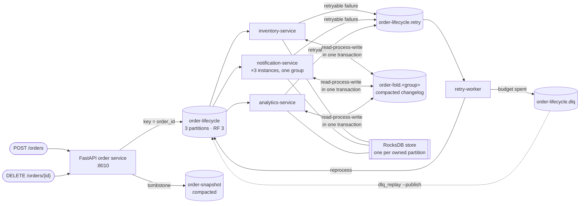

# Kafka Playground

**Kafka's hard parts, one rung at a time — built spec-first.**


-231F20)


A three-broker Kafka cluster and one order-processing pipeline, grown across nine
numbered specs — each rung introducing a distributed-systems problem the previous
rung was too naive to have.

---

## Why this exists

Most Kafka material stops at produce and consume. That part is easy. The parts that
are not easy — a rebalance that revokes a partition mid-batch, a consumer whose
in-memory state evaporates when it loses ownership, one undecodable message that
blocks a partition forever, a compacted topic that quietly eats your event history,
a duplicate that survives an offset commit — only show up under load and failure,
and only if you go looking for them.

So this repo goes looking, deliberately. One pipeline, built in order, where each
step exists **because the previous step left a specific gap**. Every walkthrough
ends with a *Known gaps, all deliberate* table naming the spec that closes each one;
that table is the spine of the project, not an apology. Nothing was built because it
seemed like a good idea — each rung starts as a written requirement, gets a design
with its rejected alternatives recorded, and is only then implemented.

It is a study, not production software. It is built like production software.

---

## Architecture



Three brokers in KRaft mode (`kafka`, `kafka-2`, `kafka-3` — all voters, no
ZooKeeper), on host ports `9092`, `9094`, `9095`. Topic auto-creation is off on
purpose, so a typo is an error rather than a silent empty topic. Each consumer keeps
its fold in an embedded RocksDB store scoped to the partitions it currently owns, and
rebuilds it from its group's compacted changelog when a rebalance hands it a new one.

---

## The ladder

| # | What it adds | Kafka concepts | Deep dive |
|---|---|---|---|
| [000](specs/000-foundations/requirements.md) | The cluster itself, in Docker, reachable from host and containers | KRaft, listeners vs advertised listeners, topics, partitions, offsets, log segments | [kafka-cli.md](docs/kafka-cli.md) |
| [001](specs/001-prepaid-order-service/requirements.md) | An HTTP order service publishing a lifecycle; three services consuming it | Keys → partitions, ordering per key, fan-out via distinct `group.id`, at-least-once | [order-flow.md](docs/order-flow.md) |
| [002](specs/002-consumer-groups-rebalancing/requirements.md) | Three notification instances in **one** group, dividing the partitions | Partitions as the unit of parallelism, rebalance cost, `cooperative-sticky`, KIP-848, static membership | [consumer-groups.md](docs/consumer-groups.md) |
| [003](specs/003-durable-consumer-state/requirements.md) | The fold moves out of process, so it survives losing a partition | Offsets vs derived state, the dual-write problem, idempotent writes, duplicate absorption | [durable-state.md](docs/durable-state.md) |
| [004](specs/004-replication-acks-failover/requirements.md) | One broker becomes three, and `acks` becomes a lever | Replication factor, replica set vs ISR, leader election and failover, `acks=0/1/all` | [replication.md](docs/replication.md) |
| [005](specs/005-retries-dlq-poison-messages/requirements.md) | A failure path: retry topic, dead-letter topic, bounded replay | Head-of-line blocking, transient vs poison, commit ≠ processed, `min.insync.replicas` | [retries-and-dlq.md](docs/retries-and-dlq.md) |
| [006](specs/006-compaction-tombstones/requirements.md) | `DELETE /orders/{id}` via a second, compacted snapshot topic | `cleanup.policy=compact` vs `delete` — table vs log, the log cleaner, tombstones | [compaction-and-tombstones.md](docs/compaction-and-tombstones.md) |
| [007](specs/007-local-state-stores-changelog/requirements.md) | Embedded RocksDB per owned partition, restored from a per-group changelog | Co-partitioned local state, changelog topics, restore cost = keys not events, store locks | [local-state-and-changelog.md](docs/local-state-and-changelog.md) |
| [008](specs/008-transactions-exactly-once/requirements.md) | Idempotent producers, then read-process-write transactions | `enable.idempotence`, `transactional.id`, `read_committed`, last stable offset, fencing | [transactions-and-exactly-once.md](docs/transactions-and-exactly-once.md) |

Full run-throughs — commands, expected output, levers, deliberate gaps — are in
**[docs/walkthroughs.md](docs/walkthroughs.md)**.

---

## Quickstart

Requires Docker and Docker Compose. Nothing else — Python runs inside the images.

```bash
cp .env.example .env
docker compose up -d --build        # 3 brokers + UI + producer + 3 consumers + retry worker
./scripts/create_topics.sh          # auto-create is off, deliberately
./scripts/place_orders.sh 12 --advance
```

Then look at:

| Where | What |
|---|---|
| http://localhost:8080 | Kafka UI — topics, partitions, consumer groups, lag |
| http://localhost:8010/docs | The order service's OpenAPI page |
| `docker compose logs -f inventory-consumer` | The fold advancing, one event at a time |
| `docker exec -it kafka bash` | A broker shell; CLI tools in `/opt/kafka/bin/` |

A few things worth trying next:

```bash
# scale the notification group to 3 instances and watch the partitions divide
docker compose --profile scale-out up -d
docker compose --profile scale-out down          # same flag to tear down

# make a handler fail on purpose, and follow the message into retry and DLQ
HANDLER_FAILURE_MODE=transient docker compose up -d inventory-consumer
./scripts/produce_poison.sh schema

# see what gave up, then put it back
docker compose exec inventory-consumer python -m order_service.tools.dlq_replay
docker compose exec inventory-consumer python -m order_service.tools.dlq_replay --publish

# kill a leader and watch the ISR shrink
docker stop kafka-2
```

To run the Python on the host instead of in containers:

```bash
python -m venv .venv && .venv/bin/pip install -e .
.venv/bin/python -m order_service.producer.app                                    # :8010
SERVICE_NAME=inventory .venv/bin/python -m order_service.consumer.main            # or notification / analytics
.venv/bin/python -m order_service.consumer.retry_worker
```

---

## HTTP API

| Method | Path | Behaviour |
|---|---|---|
| `POST` | `/orders` | Places a prepaid order. `422` if the payment does not equal the item sum. |
| `POST` | `/orders/{id}/events` | Advances the lifecycle `PACKED → SHIPPED → DELIVERED`. `409` on an illegal transition; `"force": true` bypasses the check so you can produce out-of-order events on purpose. |
| `GET` | `/orders/{id}` | The producer's own view of the order. |
| `DELETE` | `/orders/{id}` | `204`, and publishes a tombstone to the compacted snapshot topic. |

---

## Configuration

Every behaviour that could reasonably be a lever *is* a lever, set by environment
variable, so a rung can be turned on and off without editing code. The ones that
change the most:

| Variable | Does |
|---|---|
| `PROCESSING_GUARANTEE` | `at_least_once` (default) or `exactly_once` — wraps changelog write + offset commit in a transaction |
| `PRODUCER_IDEMPOTENCE` | Stops the producer duplicating *and reordering* its own retries |
| `PRODUCER_ACKS` | `0` / `1` / `all` — how much durability a write waits for |
| `STATE_BACKEND` | `local` (RocksDB + changelog) or `memory` (the pre-007 amnesia, for comparison) |
| `HANDLER_FAILURE_MODE` | Injects `transient` or `permanent` handler failures to exercise the retry and DLQ paths |
| `RETRY_MAX_ATTEMPTS` | How much budget a message gets before the dead-letter topic |

[`.env.example`](.env.example) is the annotated full list — every value commented out
with a working default, grouped by the spec that introduced it. There are no
credentials in it; nothing in this repo takes a secret.

---

## How this repo is built: spec-driven development

The pipeline is the subject; the method is the point. No code is written until three
documents are approved, in order:

```
requirements.md  →  approve  →  design.md  →  approve  →  tasks.md  →  approve  →  implement
```

**Requirements are EARS-shaped and individually addressable.** Each acceptance
criterion gets a stable ID that design sections and tasks cite by name:

> **R7.5** — IF an event arrives at or below the stored sequence for its order THEN
> THE SYSTEM SHALL leave the fold unchanged and SHALL count the delivery, so that a
> redelivery is absorbed exactly as R3.11 and R3.13 required of the database.

"Fast", "reliable" and "robust" are not criteria. A criterion names a number or an
observable behaviour, or it does not go in.

**Every task cites the requirements it implements**, which makes traceability
mechanical rather than aspirational:

```bash
$ .claude/tools/spec-status.sh
── 007-local-state-stores-changelog
   requirements: 15 declared, 15 covered
   tasks:        13/13 complete
   ✓ fully traced
```

The script checks both directions — requirements with no task, and tasks citing a
requirement that was never declared — and exits non-zero on either. Anything in the
code that no requirement asked for is scope creep, and gets flagged rather than
quietly kept.

**The three documents have different standings.** `requirements.md` is a contract and
changes only by an explicit decision. `design.md` describes reality and is amended
when the implementation teaches it something. Decisions that cut across features —
why Postgres was chosen at 003 knowing it was wrong, why the changelog is per group
rather than per order — live in [`DECISIONS.md`](DECISIONS.md) as `X1…X14`, so a
later spec can cite the reasoning instead of relitigating it.

**There is no test suite, on purpose.** This is a learning repository about broker
behaviour; a green assertion that a mock rebalanced correctly would prove nothing
worth knowing. Verification is manual and by hand — run it against the real cluster,
kill a broker, watch what the group does. That choice is recorded rather than
implied, and [`CLAUDE.md`](CLAUDE.md) forbids adding tests so the convention cannot
drift back in accidentally.

---

## Repo layout

```
specs/                      nine features, each requirements.md + design.md + tasks.md
docs/                       one concept essay per rung, plus the CLI reference
src/order_service/
  config.py                 every env lever, validated at startup
  events.py                 the lifecycle event model and its legal transitions
  producer/                 FastAPI app, routes, the Kafka producer wrapper
  consumer/
    main.py                 entry point; SERVICE_NAME picks the handler
    runtime.py              the consume loop and rebalance callbacks
    state.py                state backends: memory, or RocksDB + changelog restore
    transactions.py         read-process-write transactions (spec 008)
    dlq.py, retry_worker.py the failure path (spec 005)
  tools/dlq_replay.py       bounded, report-first dead-letter replay
scripts/                    create_topics.sh, place_orders.sh, produce_poison.sh
docker-compose.yml          3-broker KRaft cluster, UI, and every service
DECISIONS.md                cross-cutting decisions X1…X14
CLAUDE.md                   the project's own working rules
```

---

## Using this yourself

1. **Fork or clone it**, then follow the [Quickstart](#quickstart). Everything runs
   locally; nothing needs an account or a cloud.
2. **Pick your rung.** If you care about rebalancing, read
   [consumer-groups.md](docs/consumer-groups.md) and
   [spec 002's walkthrough](docs/walkthroughs.md#spec-002--consumer-groups-rebalancing-and-partition-assignment);
   if you care about exactly-once, start at 008. The `docs/` essays stand alone.
3. **See the world as it was.** Each rung landed as one `feat(NNN)` commit, so
   `git log --oneline` then `git checkout <sha>` gives you the codebase exactly as it
   was before the next problem existed — including the naive version the next spec
   replaces.
4. **Add your own rung.** Spec `009` is unclaimed. Read
   [CONTRIBUTING.md](CONTRIBUTING.md) for the gate sequence and the requirement-ID
   conventions.

---

## Documentation index

| Document | Subject |
|---|---|
| [docs/kafka-cli.md](docs/kafka-cli.md) | Raw broker CLI — topics, groups, offsets, dumping log segments |
| [docs/walkthroughs.md](docs/walkthroughs.md) | Per-spec run-throughs, levers, and deliberate gaps |
| [docs/order-flow.md](docs/order-flow.md) | Keys, partitions, and the sync/async boundary |
| [docs/consumer-groups.md](docs/consumer-groups.md) | Group membership, assignment strategies, rebalance protocols |
| [docs/durable-state.md](docs/durable-state.md) | Offsets vs derived state, and the dual-write problem |
| [docs/replication.md](docs/replication.md) | Replicas, the ISR, `acks`, and leader failover |
| [docs/retries-and-dlq.md](docs/retries-and-dlq.md) | Head-of-line blocking, retry topics, poison messages |
| [docs/compaction-and-tombstones.md](docs/compaction-and-tombstones.md) | The log cleaner, tombstones, and table-vs-log |
| [docs/local-state-and-changelog.md](docs/local-state-and-changelog.md) | Co-partitioned RocksDB stores and changelog restore |
| [docs/transactions-and-exactly-once.md](docs/transactions-and-exactly-once.md) | Idempotence, transactions, fencing, isolation levels |
| [docs/concurrency-and-confluent-kafka.md](docs/concurrency-and-confluent-kafka.md) | How `confluent-kafka`'s threading model shapes the consume loop |
| [DECISIONS.md](DECISIONS.md) | Cross-cutting decisions and the alternatives rejected |

---

## License

[MIT](LICENSE) — use it, fork it, teach from it.
